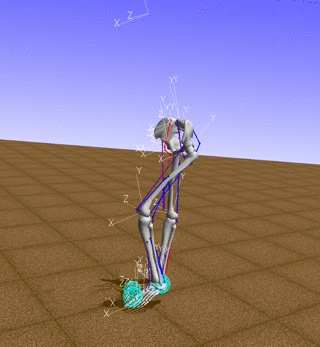
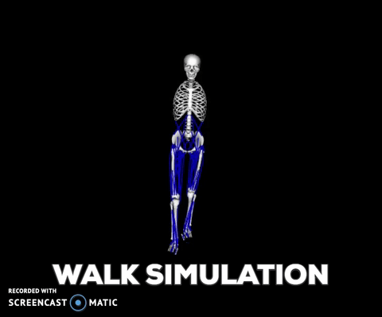
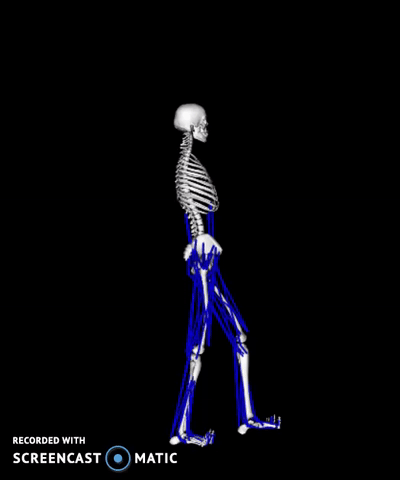

# Humanoid walking simulation using kinect and reinforcement learning

### Objective:

To compare the simulation of humanoid walking through Deep Deterministic Policy Gradient (DDPG), Naturalized Advantage Function(NAF) and Kinect.

### Problem Type:

Reinforcement Learning and Leveraging Vision through ** RGB-D** Sensor

### WALKING SIMULATION



### Method - 1 - Deep Deterministic Policy Gradient (DDPG)


```python

```

<table>
<tr><td><b>S.No</b></td><td><b>Actor - Activation Function</b></td> <td><b>Critic - Activation Function</b></td> <td><b>Image</b></td></tr>
<tr><td><b>1.</b></td><td
><b>linear</b></td> <td><b>sigmoid</b></td> <td><b>Image</b></td></tr>
<tr><td><b>2.</b></td><td
><b>linear</b></td> <td><b>tanh</b></td> <td><b>Image</b></td></tr>
<tr><td><b>3.</b></td><td
><b>sigmoid</b></td> <td><b>tanh</b></td> <td><b>Image</b></td></tr>
<tr><td><b>4.</b></td><td
><b>tanh</b></td> <td><b>tanh</b></td> <td><b>Image</b></td></tr>
<tr><td><b>5.</b></td><td
><b>linear</b></td> <td><b>sigmoid</b></td> <td><b>Image</b></td></tr>

</table>

### Method - 2 - Naturalized Advantage Function (NAF)


<table>
<tr><td><b>S.No</b></td><td><b>v_model</b></td> <td><b>μ_model</b></td> <td><b>l_model</b></td> <td><b>l_model</b></td> <td><b>Image</b></td></tr>
<tr><td><b>S.No</b></td><td><b>v_model</b></td> <td><b>μ_model</b></td> <td><b>l_model</b></td> <td><b>l_model</b></td> <td><b>Image</b></td></tr>
<tr><td><b>S.No</b></td><td><b>v_model</b></td> <td><b>μ_model</b></td> <td><b>l_model</b></td> <td><b>l_model</b></td> <td><b>Image</b></td></tr>
<tr><td><b>S.No</b></td><td><b>v_model</b></td> <td><b>μ_model</b></td> <td><b>l_model</b></td> <td><b>l_model</b></td> <td><b>Image</b></td></tr>


</table>


```python

```

### Method - 3 - Simulation using RGB- D Sensor (Kinect)


<table>
<tr><td><b>Motion Capture</b></td><td><b>Walking Simulation - Front View</b></td> <td><b>Walking Simulation - Side View</b></td> </tr>
   <tr><td></td><td></td> <td></td> </tr>

## Steps
* Capture markers captured via BodyBasics WPF
* Associate markers to appropriate joints and bones in OpenSim
* Save the associate markers as .trc file
* Save the associated motion captured as .mot file.

## Conclusion
* Simulation of walking through vision (RGB-D Sensor) gives us a better performance compared to the models trained via reinforcement learning.

<table width =900><tr><td><b>Network type</b></td><td><b>Accuracy</b></td><td><b>Inference</b></td></tr>
<tr><td>Regular Net</td><td>34.92%</td><td>Performance with 1D array is low because we destroy all the features (color and 2D)</td></tr>
<tr><td>Regular Net - After Edge detection</td><td>34.92%</td><td>Performance is same as Regular Net. Feature selection has zero impact on the performance of net</td></tr>
<tr><td>Convolutional Neural Net</td><td>69.84%</td><td>Performance increased tremendously. Increasing number of records in training and test set will increase accuracy.</td></tr>
</table>
